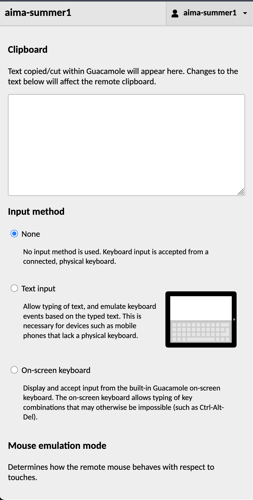

# Accessing the CEROC Guacamole Server

## If you are reading this, that means that you are accessing an activity of some sort that is hosted on the CEROC Cyber Range. 

### Where do I go?

Go to this link: [CEROC Guacamole](https://stonehunt.tntech.edu/guacamole/#/) and login using the credentials that were provided to you by your activity leader / lab instructor.


If you have been given access to a single virtual machine (most common), you will be dropped directly into the Debian environment that should look like this:


### Using Guacamole

If you need to logout or using copy/paste functions from host to VM (if included, uncommon), then you can access the Guacamole user menu. 

On Windows, you can use the key combination ```ctrl+alt+shift```

On MacOS, you can use the key combination ```control+option+shift```

To close the menu, just press the same key combination used to open it.

The main reason you will probably use this menu is to logout of the Guacamole session by clicking the drop down in the top right of this menu (click the user name).

The user menu should look like the below:





### Pitfalls

If you hit your host machine's browser refresh button a bunch of times, it will treat this as multiple connections and end up locking you out. In this case, let your lab instructor know.

If your screen looks small, press your host machine's browser refresh once. If that does not fix it, then try fullscreening your host machine's browser. 

If you mess with your virtual machine's network settings then you could potentially disconnect your connection. Please only follow your lab guide when using these VMs.

If you see an error message or just don't see the Debian desktop screen when logging it, please contact your lab instructor.

I have tested this platform on Firefox and Chrome. You can use another browser, but your mileage may vary.

Lastly, the speed of the VM is going to entirely depend on your local network connection. If your connection is poor, then your experience is going to be impacted. This may include lagging, disconnecting multiple times, and more.

